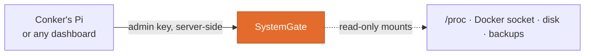

<p align="center"></p>
<h1 align="center">SystemGate</h1>
<p align="center"><b>A read-only window onto the machine. Not a remote control.</b><br/>
Host vitals, containers, processes, packages, logs and verified backups, with no way to change any of them.</p>
<p align="center">
  <a href="https://github.com/Conker-AI/systemgate/actions/workflows/ci.yml"></a>
  
  <a href="LICENSE"></a>
  <a href="https://github.com/Conker-AI/conker"></a>
</p>

SystemGate lets a dashboard or an agent see how the machine is doing without ever receiving write
access to it. By design there is no write, exec, restart, install or file-read
endpoint. Part of [Conker](https://github.com/Conker-AI/conker), and usable on its own.

## Where it fits



## Endpoints

| Route | What it reports |
|---|---|
| `GET /health` | Real probes of procfs, the Docker socket and the key store. No key. |
| `GET /vitals` | CPU, memory, disk and uptime, and whether they describe the **host** or the container. |
| `GET /containers` | Docker containers and their state. |
| `GET /processes` · `GET /services` | Processes, and listening services (metadata only). |
| `GET /packages` · `GET /logs/errors` | Installed packages and recent errors. |
| `GET /backups` | Snapshots whose manifest, hashes and archives verify. [Details](docs/backups.md) |
| `GET /runtime` | Processes, containers and ports in one bounded inventory. [Details](docs/runtime-inventory.md) |

Every route except `/health` needs `X-SystemGate-Key`. Every response is bounded.

## Quick start

Requires Docker with Compose.

```bash
cp .env.example .env              # then set SYSTEMGATE_ADMIN_KEY to a long random value
docker compose up -d --build
curl -H "X-SystemGate-Key: $KEY" http://127.0.0.1:8040/vitals
```

The API listens on `127.0.0.1:8040` only. Backups are read from `~/systemgate-backups` by default;
set `SYSTEMGATE_BACKUP_ROOT` to use another host directory.

## Security model, briefly

- **Read-only by construction.** Package and log collection use a fixed command set; no caller input
  reaches a shell.
- **Read-only mounts.** The Docker socket, `/proc`, the host root and backups are mounted `:ro`.
- **Stated trade-off.** Host disk figures need the host root visible inside the container. Drop the
  mount for container-only figures, and `/vitals` will say so.
- **Keys** are stored as PBKDF2 hashes. Use it from a server-side proxy so browsers never hold one.

Full model: [security](docs/security.md).

## Development

```bash
pip install -r requirements.txt pytest httpx
python -m pytest tests -q
```

## License

[MIT](LICENSE)
